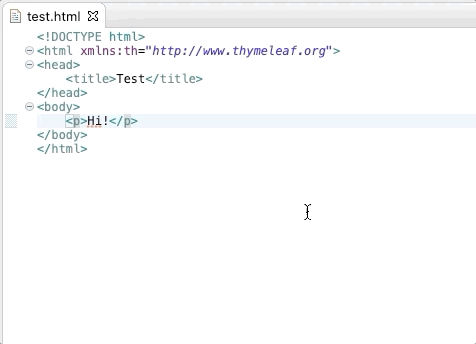
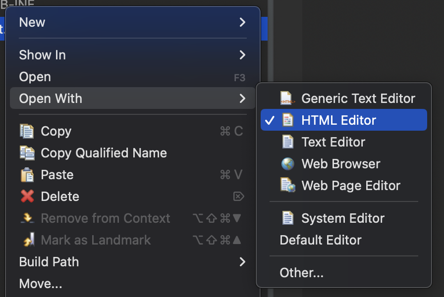

Thymeleaf - Eclipse Plugin module
=================================

[](https://github.com/thymeleaf/thymeleaf-extras-eclipse-plugin/actions)
[](https://marketplace.eclipse.org/content/thymeleaf-plugin-eclipse)

A plugin for the Eclipse IDE to add content assist features for the Thymeleaf
standard dialect processors and expression utility objects, using the Eclipse
Web Tools Platform HTML source editor.




Minimum Requirements
--------------------

 - Java 17
 - An Eclipse IDE based on 2023-06 or newer
 - A Thymeleaf 3 project

> Please note that this plugin is really only effective in the Eclipse WebTools
> HTML Editor, which was the default editor for HTML files back when this plugin
> was first developed, but may no longer be with newer versions of Eclipse or
> other installations like the Spring Tool Suite.  To check if the HTML Editor
> is being used to open HTML files, look at the note in [Invoking content assist](#invoking-content-assist)
> below.
> 
> Members of the Thymeleaf team no longer use Eclipse in their day-to-day, so
> developing for it is especially difficult.  As such, this plugin is in
> maintenance mode, doing just enough to make sure it still works with Eclipse
> so long as no drastic changes are made to the IDE.


Installation
------------

This plugin is available on the [Eclipse Marketplace](https://marketplace.eclipse.org/content/thymeleaf-plugin-eclipse).
Searching for "thymeleaf" in the marketplace website or client from Eclipse
will bring up this plugin for installation.

Alternatively, you can install this plugin using the update site URL:
https://www.thymeleaf.org/eclipse-plugin-update-site/

Or, download a ZIP archive of the plugin from the
[releases](https://github.com/thymeleaf/thymeleaf-extras-eclipse-plugin/releases)
pages.


Features
--------

### Content Assist

Content assist features are only available for dialects which have supplied
special dialect metadata files in their JARs.  Many of the dialects that come
with Thymeleaf already include such files.  Other dialects, however, are up to
the discretion of their developers.  If you're developing a Thymeleaf dialect
and would like to take advantage of content assist for your own dialect, read
the section on
[adding content assist for your dialect](#adding-content-assist-for-your-dialect).

Once those help files are available, and that the JAR is in the classpath of the
project, you can make content assist available in your HTML files through 1 of 2
ways:

#### 1. Declaring the dialect namespace and prefix in your HTML files

This is the easiest method and you may have already done this to keep the XML
validator happy:

```html
<!DOCTYPE html>
<html xmlns:th="http://www.thymeleaf.org">
```

#### 2. Applying the Thymeleaf project nature to your project

This method will make content assist available to _all_ of the HTML files in
your project, and is ideal for when you've organized your code to have plenty of
reusable HTML fragments without a common root element on which to put the XML
namespace.

To add the Thymeleaf nature to your project: right-click a project >> Configure >>
Add Thymeleaf Nature.

#### Invoking content assist

Using either method, you should now start getting content assist for any dialect
whose namespace is explicitly declared in your HTML files (method 1), or for
every dialect in your project's classpath (method 2).  This applies to
suggestions as you type, autocompletion of what you've entered so far if it
matches only one result (both of these can be invoked manually using CTRL+SPACE),
and help text when hovering the cursor over a Thymeleaf processor.

> These features are only available in the Eclipse WebTools HTML editor, which
> may not be the default for HTML files in your Eclipse installation.  To check
> that you're using WTP's HTML editor, right-click an HTML file >> Open with,
> and see if HTML Editor is selected:




Adding content assist for your dialect
--------------------------------------

The content assist features are driven by metadata about a dialect, currently
done using XML files, conforming to a schema that lives at
[https://www.thymeleaf.org/xsd/thymeleaf-extras-dialect-2.1.xsd](https://www.thymeleaf.org/xsd/thymeleaf-extras-dialect-2.1.xsd).

When content assist is invoked, this plugin will look for XML files in the
classpath of the current project whose XML namespace is `http://www.thymeleaf.org/extras/dialect`.
If such a file is found, it is loaded and the information in it is used to form
the content assist data that the Eclipse plugin uses.

Dialect developers can take advantage of this by including XML help files as
part of their dialect JARs.  All you need to do is create an XML file that
conforms to the schema above, then bundle that XML file with your JAR.

Some notes on where you put that file in the JAR:

 - it cannot go in the default package
 - the directory it goes in must be a valid Java package name

These are just short-comings of the current dialect scanning method, which
itself is built upon Eclipse's own lookup mechanisms.


Developing this plugin
----------------------

### Setup

As a base, it's best to install the Eclipe IDE for Java and Web Developers using
the Eclipse Installer.  This gives you access to most of the tools required to
work on this plugin.  After that, also install the Groovy Development Tools (can
be done from the marketplace) and any m2e connectors that may come up as a
result of trying to fix the Tycho errors in the `pom.xml` files.

### Building

With all of the above installed, you should be able to run an Eclipse instance
from within Eclipse, with the plugin included.

From the command line, you can use `mvn verify` to compile, test, and create the
plugin repository and download artifacts.

### Releasing

Having run `mvn verify`, switch to the `update-site` branch in this repo and
create a folder for the version of the plugin you're looking to release.  Then,
place all of the contents of `target/repository/update-site` into that folder.
Commit and push the changes.

Open the [Thymeleaf website project](https://github.com/thymeleaf/thymeleaf.github.io)
and place the contents of `target/compositeRepository` into the `eclipse-plugin-update-site`
folder.  Commit and push the changes.

Lastly, go to [the Eclipse Marketplace page for the plugin](https://marketplace.eclipse.org/content/thymeleaf-plugin-eclipse),
sign in to the website, and add a new version that points to the one you made in
the `update-site` branch of this GitHub repository, eg: `https://raw.githubusercontent.com/thymeleaf/thymeleaf-extras-eclipse-plugin/update-site/3.1.0/`
Don't forget to Save those changes.
